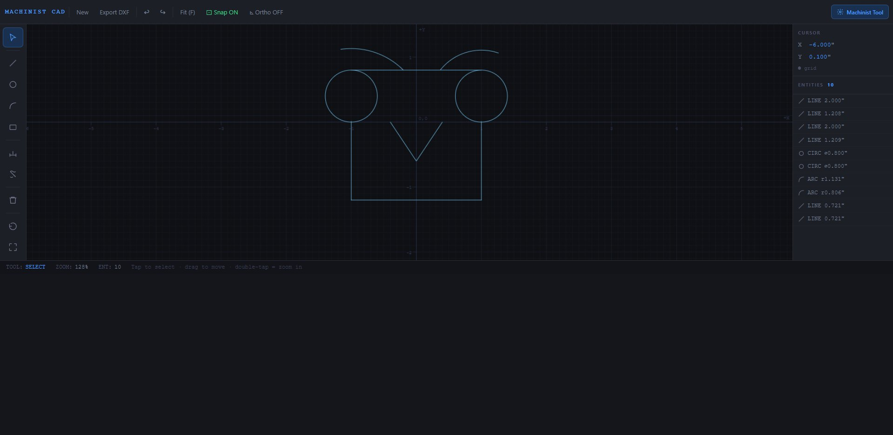

# ⚙️ Machinist Tool

A browser-based 2D CAD and Speeds & Feeds calculator built for machinists — no installs, no accounts, no fluff. Runs on any device including phones and tablets.

**[→ Open the Live Tool](https://caddyshackk.github.io/machinist-tool)**

---

## What's Inside

This repo contains two tools that work together:

### 🖊️ MachinistCAD
A 2D drafting tool designed specifically for machinists learning to read and create technical drawings. Draw lines, circles, arcs, rectangles, and dimensions using real inch-based coordinates. Export to DXF when you're done.

### ⚡ Speeds & Feeds Calculator
A practical cutting calculator covering Mill, Lathe, Drill, and Tap modes. Designed for beginners with plain-language labels, chip load checking, and feed-per-rev display.

---

## MachinistCAD Features

- **Drawing tools** — Line, Circle, Arc, Rectangle, Dimension, Trim
- **Object snap** — Endpoints, midpoints, and centers snap automatically
- **Grid snap** — Auto-scales with zoom level (0.05" to 1.0")
- **Ortho mode** — Locks movement to horizontal or vertical
- **Trim tool** — Draw a slash across any line or arc to cut it
- **Move/Select** — Click to select, drag to reposition
- **Undo / Redo** — 60-step history
- **DXF export** — R12 ASCII format, compatible with most CAD software
- **Coordinates in inches** — Engineering Y-up convention throughout
- **Starter drawing** — Opens with a sample flanged bushing to learn from
- **Mobile friendly** — Full touch support with pinch-to-zoom and finger drawing

---

## Keyboard Shortcuts

| Key | Action |
|-----|--------|
| `S` | Select / Move |
| `L` | Line |
| `C` | Circle |
| `A` | Arc |
| `R` | Rectangle |
| `D` | Dimension |
| `T` | Trim |
| `F` | Fit view |
| `Ctrl+Z` | Undo |
| `Ctrl+Y` | Redo |
| `Del` | Delete selected |

---

## Mobile Controls

| Gesture | Action |
|---------|--------|
| Single tap | Draw / Select |
| Single finger drag | Pan |
| Two finger pinch | Zoom |
| Double tap | Zoom in on point |
| Drag in Trim mode | Draw cut stroke |

---

## Files

| File | Description |
|------|-------------|
| `index.html` | Speeds & Feeds calculator — main entry point |
| `styles.css` | Calculator styles |
| `script.js` | Calculator logic |
| `cad.html` | MachinistCAD 2D drafting tool |

---

## Who This Is For

Built for apprentice machinists and shop students learning the trade. The goal is a tool that feels familiar to anyone who has used AutoCAD or Fusion 360 — but runs instantly in a browser on any device, with no learning curve to get started.

---

## Built With

- Vanilla JavaScript — no frameworks or dependencies
- HTML5 Canvas API
- Deployable as a static site — GitHub Pages, Netlify, or any web host

---

## Roadmap

- [ ] Coordinate input box (type exact X, Y values)
- [ ] Copy / Mirror / Rotate
- [ ] Layers panel
- [ ] Print to scale (1:1, 2:1, etc.)
- [ ] Student challenge mode — reproduce a blueprint and check your work

---

## Author

Travis Kidd — CNC Machinist & Programmer  
GitHub: [@Caddyshackk](https://github.com/Caddyshackk)
